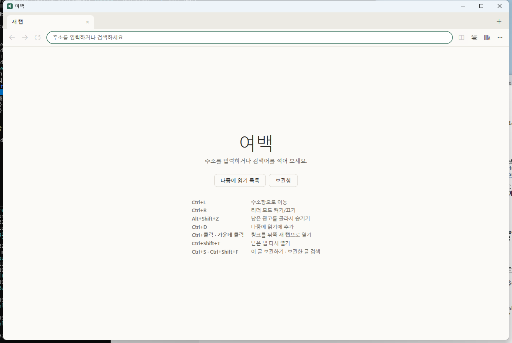
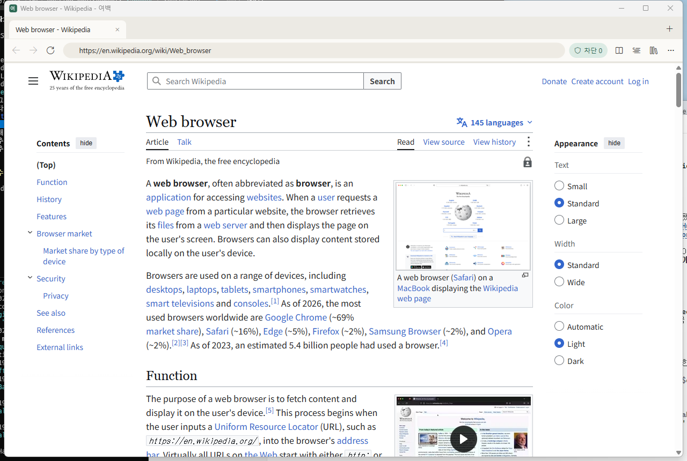
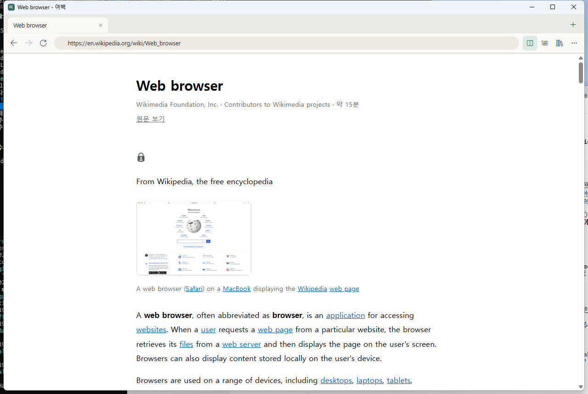
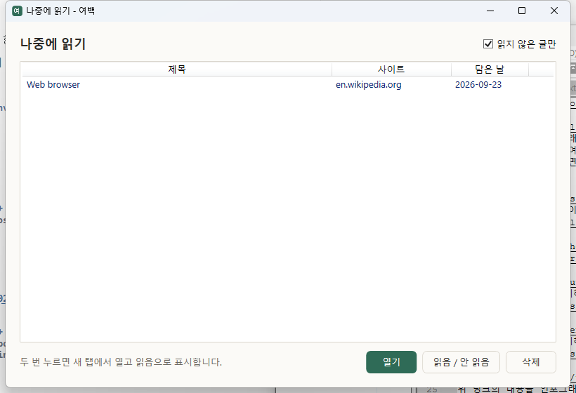

**[Read this README in Korean](README_kr.md)**

# Yeobaek

<p align="center">
  
</p>

> A personal browser that leaves room to read, instead of room for ads

**Yeobaek** is a Windows desktop app for reading your favorite blogs and technical sites without distractions. It hosts WebView2 (Chromium) and handles network requests and early page scripts itself, so it can clean up pages before ads appear.

- **Platform:** Windows 10 version 1809 or later, or Windows 11
- **Runtime:** .NET 10 (LTS), WPF
- **Engine:** Microsoft Edge WebView2 Runtime
- **Interface languages:** Korean (default), English, Japanese, and Simplified Chinese

> New here? Start with the **[getting started guide](#getting-started)**. It covers setup, browsing, hiding ads, reader mode, and saving articles.

---

## Why Yeobaek exists

Yeobaek focuses on one job: **reading**. A browser dedicated to a small set of sites you actually visit can make different tradeoffs from a general purpose browser.

Some sites insert ads after the page loads. Their scripts inspect the article and add elements later, so hiding individual elements after the fact is unreliable. As the WebView2 host, Yeobaek can run code before the page's own scripts and prevent some of those insertions.

Rules live in a local SQLite database and take effect as soon as they change. Yeobaek does not depend on a browser extension store to publish updates or on Manifest V3 extension rule limits.

The intended scope is **a few dozen sites you regularly read**. Keeping that list small makes the rules manageable for one person.

---

## Features

### Three layers of ad defense

| Layer | Method | What it does |
|---|---|---|
| 1 | `WebResourceRequested` | Blocks known ad requests at the network level. |
| 2 | `AddScriptToExecuteOnDocumentCreated` | Runs before ad scripts and can prevent insertion. |
| 3 | Reader mode | Extracts the article and leaves the surrounding page behind. |

### Pick an element and remember it

If an ad remains, press `Alt+Shift+Z` and select it. Yeobaek saves the selector for that domain in SQLite and applies it automatically on later visits, before the page is drawn. There is no rule count limit.

### Tabs and link context menu

Keep the article you are reading open while following references:

- Right-click a link for **Open in background tab**, **Open and switch to new tab**, **Open in new window**, **Copy link address**, or **Add to reading list**.
- `Ctrl`+click or middle-click opens a background tab. `Ctrl+Shift`+click opens a tab and switches to it.
- `Shift`+click opens a new window.
- Pages that use `window.open()` or `target="_blank"` are directed to a tab instead of a separate popup window.
- Unrequested popups are blocked. If you need one, select **Open** in the notification bar.

### Comfortable reading

Reader mode (`Ctrl+R`) extracts the main article from the rendered page. Set the font, article width, line spacing, and theme in `settings.json`. The system theme is supported, Korean line breaks use `word-break: keep-all`, and you can keep a reading list.

### Offline archive and full-text search

Press `Ctrl+S` while reading to save an article and its images on your PC. You can open the saved copy without internet access, even if the original page changes or disappears. Search saved titles and article text from the archive (`Ctrl+Shift+F`) using SQLite FTS5. Search also supports Korean substrings, including two-character terms. Space-separated terms must all appear in a result.

---

## Getting started

A simple first session is **launch → enter an address → read → try reader mode → add to the reading list or archive**. The screenshots below were captured from the Windows app. They show [Wikipedia's Web browser article](https://en.wikipedia.org/wiki/Web_browser).

1. [Install and launch](#1-install-and-launch)
2. [Take a tour](#2-take-a-tour)
3. [Browse a page](#3-browse-a-page)
4. [Reduce ads](#4-reduce-ads)
5. [Read comfortably with reader mode](#5-read-comfortably-with-reader-mode)
6. [Save to your reading list](#6-save-to-your-reading-list)
7. [Archive and find articles](#7-archive-and-find-articles)
8. [Change settings](#8-change-settings)
9. [Troubleshooting](#9-troubleshooting)

### 1. Install and launch

There is no setup wizard. The easiest way to get started is to download the portable app:

1. **Download Yeobaek.** Open the [v0.1.0 release](https://github.com/jacking75/Yeobaek/releases/tag/v0.1.0) and download `Yeobaek.exe` under **Assets**. This build is for Windows x64.
2. **Install the runtime.** If .NET 10 Desktop Runtime is missing, install its **Windows x64** version from [dotnet.microsoft.com/download](https://dotnet.microsoft.com/download). You do not need the SDK to run the downloaded app.
3. **Launch.** Double-click `Yeobaek.exe`. For quick access later, right-click its running taskbar icon and pin it to the taskbar.

To build from source instead:

1. Install the **.NET 10 SDK (Windows x64)** from [dotnet.microsoft.com/download](https://dotnet.microsoft.com/download).
2. At [github.com/jacking75/Yeobaek](https://github.com/jacking75/Yeobaek), select **Code → Download ZIP** and extract it. If you use Git, run `git clone https://github.com/jacking75/Yeobaek.git`.
3. Open a terminal in the extracted folder, where `README.md` is located. In File Explorer, you can Shift+right-click an empty area and choose **Open in Terminal**. Run:

   ```powershell
   dotnet build
   ```

   Wait for **Build succeeded** or a report of zero warnings and zero errors.

4. Double-click `bin\Debug\Yeobaek.exe`.

> **WebView2 Runtime** is already installed on Windows 11 and most Windows 10 systems. If it is missing, Yeobaek shows an installation link at startup. Install it and launch the app again.
>
> To build a portable executable yourself, see the `dotnet publish` command under [Build and run](#build-and-run).

### 2. Take a tour



When Yeobaek opens, it shows a **new tab** page. Enter an address or search terms in the long box at the top and press `Enter`. The **Reading list** and **Archive** buttons in the center take you to saved articles. Frequently used shortcuts appear below them.

| Area | What it does |
|---|---|
| **Tab bar** | Shows open pages. Select `×` to close a tab or `+` to open one. Middle-click a tab to close it. |
| **← → ⟳** | Go back, go forward, or reload. |
| **Address bar** | Enter an address or search terms, then press `Enter`. |
| **Shield, for example “Blocked 12”** | Shows the number of ad requests blocked on this page. Select it to allow ads on this site. See [step 4](#4-reduce-ads). |
| **Reader button** (open book) | Turn reader mode on or off. See [step 5](#5-read-comfortably-with-reader-mode). |
| **Reading list button** (lines) | Open the reading list. See [step 6](#6-save-to-your-reading-list). |
| **Archive button** (bookshelf) | Find saved articles. See [step 7](#7-archive-and-find-articles). |
| **⋯ menu** | Find all commands and shortcuts, edit settings, or open the data folder. |
| **Notification bar** | Appears briefly at the bottom. Hover over it to keep it visible. Some messages include **Undo** or **Open** buttons. |

Hover over a button to see its description and shortcut.

### 3. Browse a page

- **Open an address or search:** Select the address bar or press `Ctrl+L`, type a site such as `example.com` or a search query, then press `Enter`. Google is the default search engine; [step 8](#8-change-settings) explains how to change it.

  

  The shield beside the address bar shows the blocking status. The next buttons open reader mode, the reading list, the archive, and the menu.

- **Tabs:** Open `Ctrl+T`; close `Ctrl+W`; next or previous `Ctrl+Tab` / `Ctrl+Shift+Tab`; restore the last closed tab `Ctrl+Shift+T`.
- **New window:** `Ctrl+N`.
- **Open links:**

  | Action | Result |
  |---|---|
  | Click | Open in the current tab. |
  | `Ctrl`+click or middle-click | Open in a background tab, so you can keep reading. |
  | `Ctrl+Shift`+click | Open in a new tab and switch to it. |
  | `Shift`+click | Open in a new window. |
  | Right-click | Choose a tab or window, copy the address, or add the link to your reading list. |

- **Zoom:** Use `Ctrl`+mouse wheel or `Ctrl`+`+` / `-`. Press `Ctrl+0` to reset.
- **Find on the page:** `Ctrl+F`. **Reload:** `F5`. `Ctrl+R` is reserved for reader mode.
- Yeobaek blocks unrequested **popups**. If you need one, select **Open** in the notification bar.

### 4. Reduce ads

Known ads are blocked automatically before the page is drawn. The shield's **Blocked** count shows how many requests were stopped on the current page.

**Hide an ad that remains**

1. Press `Alt+Shift+Z`, or right-click the ad and choose **Hide ad in this area**.
2. Move the pointer over the ad. An **orange outline** follows it, and the selector appears at the bottom of the window.
3. If the outline covers too little, press `↑` to select a larger parent element. Press `↓` to make it smaller.
4. Click or press `Enter` to hide the selected area. Yeobaek will hide it automatically on later visits to this site. Press `Esc` or right-click to cancel.
5. If you hide the wrong area, select **Undo** in the notification bar. Later, use **⋯ → Manage rules for this site** to delete the rule.

> Select an outline that covers only the ad, so article text stays visible. In the rule manager, you can also enter a selector manually or apply a rule to every site.

**Allow ads on a site you want to support**

Select the shield or press `Alt+Shift+A`. The shield turns orange and the site becomes an **exception**, allowing its ads. Select it again to resume blocking. This can also help when blocking prevents a site from working correctly.

**Edit the block list (optional)**

Choose **⋯ → Edit block list (blocklist.txt)** to open the file in Notepad. Yeobaek includes a default list; put only additions or removals in this file, one entry per line. Save it and return to the Yeobaek window to apply the changes.

```text
# Block this host and its subdomains
ads.example.com
# Block URLs whose path contains /banner/
/banner/
# Exclude an entry from the built-in list (prefix it with !)
!static.criteo.net
```

### 5. Read comfortably with reader mode

- Press `Ctrl+R` or select the **Reader** button to show the article in a spacious single column without the surrounding ads, menus, or comments. Press it again to return to the original page.

  

  A highlighted reader button means reader mode is active. To reload the page, press `F5`.

- The address bar still shows the original article URL. Select **View original** below the article title to open the source page.
- Reader mode may not find an article on shopping, social media, or search pages. Yeobaek leaves the page as it is and shows a notification.
- Adjust font size, line spacing, article width, and dark mode in [step 8](#8-change-settings).

### 6. Save to your reading list

- **Current page:** Press `Ctrl+D`. **A linked page:** Right-click the link and choose **Add to reading list**.
- Select the **Reading list** button on the toolbar. Double-click an article to open it in a new tab and mark it **read**.

  

  You can also select an article once and choose **Open**. To find articles you have already read, clear the **Unread only** checkbox at the top right.

- Change a selected article between **read** and **unread**, or select **Delete** to remove it from the list.

### 7. Archive and find articles

- **Save an article:** Press `Ctrl+S` on the page, or choose **⋯ → Save this article offline**. Yeobaek saves the article **and its images** on your PC. The saved copy remains available offline if the original changes or disappears. Pages with many images can take a few seconds.
- **Search saved articles:** Press `Ctrl+Shift+F` or select the **Archive** button, then type in the search box. Yeobaek searches titles and article text.
  - Separate terms with spaces to find articles containing **all** of them.
  - Two-character Korean terms work, and a search can match a substring within a Korean word.
  - Clear the search box to see all archived articles, newest first.
- Choose **Open saved copy** to read offline, **Open original** to visit the current page, or **Delete** to remove the saved article and images.
- Press `Ctrl+S` again on the same article URL to replace the archive copy with its latest content.

### 8. Change settings

Choose **⋯ → Edit settings (settings.json)** to open it in Notepad. Edit and save the file, then return to Yeobaek to apply most changes. Reader appearance changes take effect the next time you enter reader mode. Comments after `//` are allowed in the file.

Set `language` to `"ko"` (default), `"en"`, `"ja"`, or `"zh-CN"` for Korean, English, Japanese, or Simplified Chinese. **Restart Yeobaek after changing the language** so the window and WebView2 menus update.

```jsonc
{
  "startPage": "about:blank",                          // First page in a new window or tab; for example, "https://news.hada.io"
  "searchUrl": "https://www.google.com/search?q={0}",  // Search URL; {0} becomes the search query
  "language": "ko",                                    // ko, en, ja, or zh-CN
  "reader": {
    "fontSizePx": 17,       // Font size: 12–32
    "lineHeight": 1.85,     // Line spacing: 1.2–2.6
    "maxWidthRem": 42,      // Article width: 28–80
    "fontFamily": "\"Pretendard\", \"Malgun Gothic\", system-ui, sans-serif",
    "theme": "system"       // system (Windows setting), light, or dark
  }
}
```

- To search with Naver, set `"searchUrl": "https://search.naver.com/search.naver?query={0}"`.
- If the settings file is invalid, Yeobaek shows a notification and uses defaults. Delete the file to recreate the default settings at the next launch.

### 9. Troubleshooting

| Problem | What to do |
|---|---|
| Yeobaek says **WebView2 Runtime is missing** at startup. | Install the **Evergreen Bootstrapper** from the link in the message, then launch Yeobaek again. |
| The terminal says **`dotnet` was not found**. | Install the .NET 10 SDK, open a **new terminal**, and retry. |
| A site looks broken or its buttons do not work. | If you just hid an element, remove that rule from **⋯ → Manage rules for this site**. Otherwise, select the shield to allow ads on this site. |
| A site says ad blocking software is interfering. | The site has detected blocking. Add it as an exception with the shield if you want to continue. |
| Reader mode does not turn on. | Yeobaek could not identify an article on this page. Read it in the original view. |
| Some images are missing from a saved article. | They could not be downloaded during archiving; the notification shows a count. They may appear when you are online. You can also return to the source and press `Ctrl+S` again. |
| Will I stay signed in? | Yes. Cookies remain in Yeobaek's own profile at `%LOCALAPPDATA%\Yeobaek\WebView2`. Passwords and autofill information are not saved. |
| How do I move to another PC? | Choose **⋯ → Open data folder** and copy `rules.db`, `blocklist.txt`, `settings.json`, and the `archive` folder. |
| Something behaves unexpectedly. | Open **⋯ → Open data folder** and include `error.log` when reporting the problem. |
| How do I uninstall it? | Delete the Yeobaek app folder and `%LOCALAPPDATA%\Yeobaek`. |

---

## Requirements

- Windows 10 version 1809 or later
- [.NET 10 Desktop Runtime](https://dotnet.microsoft.com/download)
- [Microsoft Edge WebView2 Runtime](https://developer.microsoft.com/microsoft-edge/webview2/) (included with Windows 11)

---

## Build and run

```bash
git clone https://github.com/jacking75/Yeobaek.git
cd Yeobaek
dotnet build                      # Output: bin\Debug\Yeobaek.exe
dotnet run --project src/Yeobaek
dotnet test                       # Unit tests: bin\Debug\tests\
```

Build output goes to `bin\<Configuration>\` at the repository root. There is no extra framework directory such as `net10.0-windows` (see `Directory.Build.props`).

To publish a single executable at `bin\publish\Release\Yeobaek.exe`:

```bash
dotnet publish src/Yeobaek -c Release -r win-x64 --self-contained false -p:PublishSingleFile=true -p:IncludeNativeLibrariesForSelfExtract=true
```

The result is one `Yeobaek.exe` file of approximately 5 MB. It bundles the native WebView2Loader and SQLite DLLs and debug symbols, so you can copy just that file. The destination PC still needs the .NET 10 Desktop Runtime.

### Project layout

```text
src/Yeobaek/
├─ App.xaml(.cs), AppServices.cs     Startup and shared services (one WebView2 environment)
├─ MainWindow.*                      Tabs, toolbar, shortcuts, and notifications
├─ Browser/                          Tabs, network blocking, early scripts, menus, popups, message bridge
├─ Reader/                           Reader mode (SmartReader) and article extraction
├─ Archive/                          Offline saving, image downloads, and serving saved pages
├─ Data/                             SQLite rules, exceptions, reading list, archive index, settings
├─ Ui/                               Theme, localization binding, rule manager, reading list and archive windows
├─ Strings/                          Korean, English, Japanese, and Simplified Chinese string tables
└─ Assets/                           prelude.js, picker.js, and icon
tests/Yeobaek.Tests/                 Core logic unit tests (xUnit)
```

---

## Keyboard shortcuts

| Keys | Action |
|---|---|
| `Ctrl+T` | New tab |
| `Ctrl+N` | New window |
| `Ctrl+W` | Close tab (or window if it is the last tab) |
| `Ctrl+Tab` / `Ctrl+Shift+Tab` | Next / previous tab |
| `Ctrl+Shift+T` | Restore the last closed tab |
| `Ctrl+R` | Toggle reader mode (`F5` reloads) |
| `Alt+Shift+Z` | Pick an ad element (`↑`/`↓` adjust the selection; `Esc` cancels) |
| `Alt+Shift+A` | Allow ads on this site / resume blocking |
| `Ctrl+D` | Add the current page to the reading list |
| `Ctrl+S` | Archive this article and its images for offline reading |
| `Ctrl+Shift+F` | Open the archive and search saved articles |
| `Ctrl+L` | Focus the address bar |
| `Alt+←` / `Alt+→` | Back / forward |

---

## Data location

```text
%LOCALAPPDATA%\Yeobaek\
├─ rules.db          Hide rules, ad exceptions, reading list, archive entries, and search index
├─ blocklist.txt     Additions to or removals (!) from the built-in network block list
├─ settings.json     Start page, search URL, language, reader font, spacing, width, and theme
├─ reader\           Reader mode pages (removed after seven days)
├─ archive\          Saved articles (index.html and images\ for each; kept until deleted in the archive)
├─ error.log         Unexpected errors (only present if an error occurred)
└─ WebView2\         WebView2 user profile (cookies and login sessions)
```

Back up `rules.db` and `blocklist.txt` to preserve your rules on another PC. Copy `settings.json` for your preferences and `archive\` if you also want saved articles. You can open `blocklist.txt` and `settings.json` directly from the `⋯` menu; Yeobaek rereads them when you return to its window.

---

## Roadmap

- [x] Network request blocking
- [x] Scripts injected before document creation
- [x] Element picker and SQLite rule storage
- [x] Tabs and link context menu
- [x] Reader mode (SmartReader)
- [x] Reading list and ad blocking exceptions
- [x] FTS5 full-text search
- [x] Offline archive

---

## Notes

WebView2 shares the system's Edge WebView2 Runtime, keeping the app small and receiving Chromium security fixes through runtime updates. Yeobaek does not plan to load the official uBlock Origin extension with `AddBrowserExtensionAsync`. WebView2 inherits Edge's Manifest V2 policy. Edge announced that it would begin phasing out MV2 for general users in August 2026, finish within the year, and extend the enterprise transition into early 2027. Yeobaek implements blocking in host code instead of an extension. That policy schedule may change; check its current status before relying on it.

A site's HTML changes can break saved selectors. On sites with generated class names, selectors based on `#id` or `[data-*]` attributes tend to last longer.

Yeobaek is deliberately designed for **a small set of sites**. Keeping that set small makes personal rule maintenance practical. Use `Alt+Shift+A` if you want to allow ads on blogs you value.

---

## License

Personal use. MIT.
